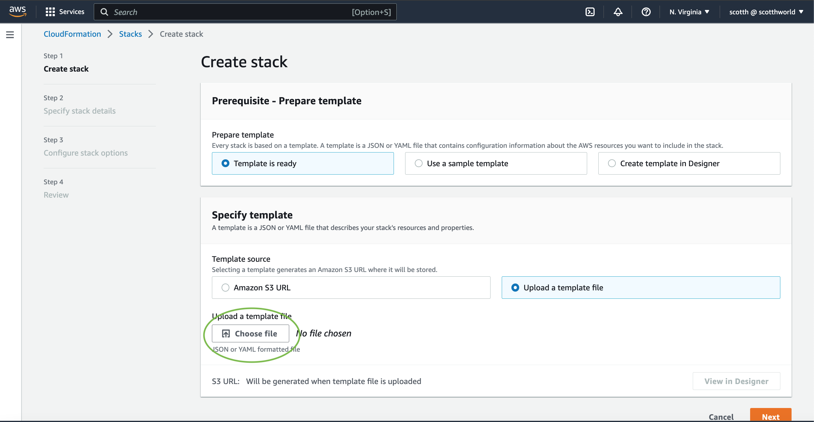

# AWS Snakemake Pipeline

## Current Status
### Currently this repo is just CloudFormation templates, scripts and some documentation. Future effort would wrap an AWS Amplify App around the deployment and execution of pipelines.
#

## Installation
### This architecture and AWS deployment is guided by a recent blog found [here](https://aws.amazon.com/blogs/architecture/genomics-workflows-part-2-simplify-snakemake-launches/) that elevates Snakemake as a player in Genomics workflows.
 

### **The deployment to AWS requires an AWS account that has the AdministratorAccess managed policy**
 

### **This deployment documentation assumes a happy path and success at each step. This is not always the case ;-(**
 

### This deployment flow, described in detail below, will create resources in AWS, use a CodeBuild project to put the biolabs/snakemake container into ECR and install latest version of Tibanna. After this is complete, you will need to get the **example** snakemake configuration into the created S3 bucket. Now you can run a Lambda function that will kick off the pipeline.
 

#### AWS CloudFormation Deployment
1. Open the CloudFormation Service in the AWS console.
2. Create a stack with new resources
3. Select **Upload a template file** and use the **Choose File** button to select the AWS-WGS-Snakemake.yaml file in this repo
4. Hit Next
5. On this screen name the stack **wgs-stack** and leave the network defaults as they are unless this CIDR block conflicts with an existing one, in which case you will need to specify new blocks
6. Hit Next twice and check the box for **I acknowledge that AWS CloudFormation might create IAM resources with custom names.**
7. Then hit submit to start the stack deployment. Some images below should help as you step through this part

   

    

   

     

    

 

#### AWS CodeBuild Execution
1. Log into the AWS Console and go to the CodeBuild projects
2. Select **Build Projects** on the left side navigation
3. Start the wgs-**create**-pipeline-codebuild project and watch for success of all phases
   
   

     

   

     

   

 

#### Time to look around
- The engine for this deployment will be powered by a snakemake container and a Tibanna step function that calls Lambdas to allocate the appropriate EC2 instances based on snakefile parameters. From the AWS console navigate to the Elastic Container Registry and you should see a repo that has the snakemake container like the image below.

   

 

- The Tibanna Step function and Lambdas can be seen by going to the respective services in the console and looking around. You should see something like the images below.

   

 

   

- The engine will fire up when an Elastic Container Service (ECS) task gets executed. In the above blog this happens when new snakemake files are **PUT** into the S3 bucket. The S3 bucket will notify a Lambda function that executes the ECS task. Currently the S3 bucket doesn't have the trigger to call a Lambda but a Lambda exist that can be called directly. Look around console in ECS and Lambdas and you should see the following.

  

 

   

 

   

 

#### Load the data 

### The fuel for the engine is the data you put into the S3 bucket called **wgs-pipeline-bucket-xxxxxxxx***. This repo provides the example data and an AWS CLI script to sync this data to the S3 bucket. You can also create the folders and upload through the AWS Console.
 

1. Install the AWS CLI and configure for the same user that created this deployment
2. From the S3 directory in this repo, sync the data directory with the S3 bucket created. The bucket name will begin with wgs-pipeline-bucket and will also include a unique identifier at the end. It will look something like wgs-pipeline-bucket-b2e2f990

`aws s3 sync data s3://wgs-pipeline-bucket-xxxxxxxx*`
 

3. Verify there is a **data** folder in the S3 bucket. This should look like below image. Make sure the folder structure is right!

 

#### Fire up the engine
### **IF** things have gone well up to this point, you should be able to start a pipeline from the **WGSStateExecutor** Lambda.
 

1. Navigate to the lambda console, and click on the **WGSStateExecutor** Lambda.
2. Take a look at the **Configuration** tab and the environment variables defined.
3. IMPORTANT! You will have to change the **TASK** variable for the right revision. It typically has to be moved up 1 or 2 like from wgs-pipeline-task:5 to wgs-pipeline-task:6
4. You can find the right revision in the ECS console.
5. Once this revision is correct, create a Lambda Test configuration and then run the Lambda. Some images below to help with this part.

 

 

    

   

    

#### Follow the trial of the pipeline
1. Start in Cloudwatch logs looking at the /ecs/wgs-pipeline-snakemake log

    

 

2. If you get an ECS task started correctly, then you can start looking at the Tibanna Step function

    

 
3. You will also see Tibanna start creating EC2 instances in the EC2 console for each step in the snakemake pipeline
   
   

 

4. Eventually the mapped_reads folder in S3 will have 2 file created when a successful run completes

 

 

#### More Sections to come . . .
#

## Removal

1. Log into the AWS Console and go to the CodeBuild projects
2. Select **Build Projects** on the left side navigation
3. Start the wgs-**remove**-pipeline-codebuild project and watch for success of all phases
   
   

    

   

    

   

    

4. Next, you will need to save off your data in the S3 bucket called **wgs-pipeline-bucket-xxxxxxxx** and then empty and delete the bucket
5. Finally, after the CodeBuild project has completed and you have deleted the S3 bucket, go to the CloudFormation service in the AWS console and delete the stack you created initially

    
